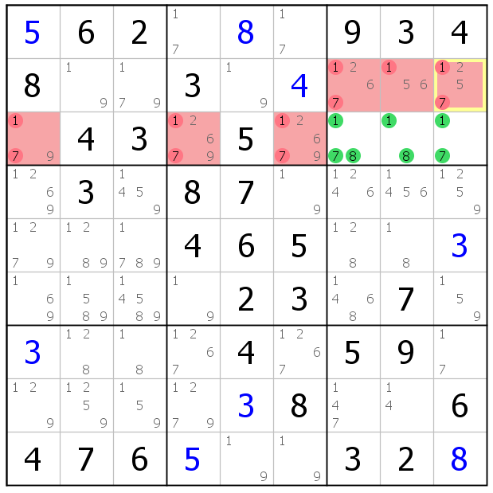
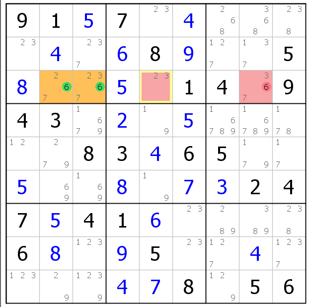

# 數獨技巧

## Singles(單一數)
  ### 1. Full House(浪漫滿屋)(5顆星)
  ```
  在每一個row、column、block，僅剩一個數時，就填1~9缺的那個數，也就是8缺1，填了屋子就滿了 
  ```
  
  
  
  ```
  1. 黃色cell那條coloumn就缺一個數了
  2. 黃色cell那block就缺一個數了
  3. 黃色cell那條row就缺一個數了
  ```
  ### 2. Hidden Single(排除法)(5顆星)
  ```
  由row、column、block來排除哪些cell不能填哪些數字，那該數字若只能填的格子僅剩1個cell那就是了
  有人可能會細分row hidden single、column hidden single、block hidden single
  ```
  
  
  ```
  1. 第六block中，由四、五block的2使用row hidden single排掉格子(紅色部分)，那黃色格子就是剩餘能填2的地方
  2. 第三block中，由二、六、九block的4使用row跟columnhidden single排掉格子(紅色部分)，那黃色格子就是剩餘能填4的地方
  ```
  ### 3. Naked Single(唯一餘數)(4顆星)
  ```
  看某個cell，該cell的row、column、block是否有8個不同的數，如果有的話，那該cell就是只剩最後一個數能填了
  ```
  
  ```
  1. 第八block中，黃色的cell中，row、column、block除了5以外的數都有了，那該cell只會是5
  ```
## Intersections
  ### 1. Locked Pair(死鎖數對)(5顆星)
  ```
  選定同block且僅有2個相同候選數的cell，那該對應的row、column、block其它的cell都不會是那兩個候選數
  ```
  
  
  ```
  1. 第八block中有兩個cell的候選數皆是1跟4，這兩cell因是同row，所以同row上其它cell的候選數就不會是1跟4，也由於這兩cell也是同block，因此該block其餘cell候選數也不會是1跟4
  2. 第二block中，鎖定候選數為5跟8的兩個cell，這兩個cell既是同block也是同column，所以該block與column的其餘cell的候選數都不會是5跟8
  ```
  ### 2. Locked Triple(死鎖三數組)(3顆星)
  ```
   原理跟Locked Pair一樣是選定同block，只是鎖定3個cell且僅剩3個候選數的，對應的row、column、block其餘的cell也不會是那三個候選數，允許少腿
  ```
  
  
  
  ```
  1. 第六block中，最左3個cell僅有2、4、9三個候選數，Locked Triple允許缺腿，所以有一cell僅有2跟9也行，這三個cell既是同column也是同block，所以該block與column的其餘cell候選數都不會是2、4、9
  2. 第三block中，最下3個cell僅有1、7、8三個候選數，這三個cell既是同row也是同block，所以該block與column的其餘cell候選數都不會是1、7、8
  3. 第四block中，最左3個cell僅有3、7、9三個候選數，這三個cell既是同column也是同block，所以該block與column的其餘cell候選數都不會是3、7、9
  ```
  ### 3. Locked Candidates Type1(Pointing)(5顆星)
  ```
  選定同block中某個數字，該數僅在兩個cell中出現，且要在同row或同column，那該數字就不會在其餘對應的row或column出現
  ```
  
  
  ```
  1. 黃色cell為同block同row，該block也僅有黃色cell能填6，那同個row其餘cell都不能填6
  2. 黃色cell為同block同column，該block也僅有黃色cell能填1，那同個column其餘cell都不能填1
  ```  
  ### 4. Locked Candidates Type2(Claiming)(1顆星)
  ```
  運作模式與Locked Candidates Type1(Pointing)相反，這是先看哪個row或哪個column，如果該數被限制在同一個block裡，那該block其餘的cell就不會是該數
  ```
  
  
  ```
  1. 黃色cell的row中，6僅能在綠5的兩個cell中出現，該兩個cell也是同block，所以同個block的其餘cell都不能出現6
  2. 黃色cell的row中，5僅能在綠5的兩個cell中出現，該兩個cell也是同block，所以同個block的其餘cell都不能出現5
  ```
## Subsets(數組)
  ### 1. Naked Pair(顯性數對)(3顆星)
  ```
  拓展版的Naked Single，看某個row或column中是否有僅有相同數對的2個cell，那該row或column其餘的cell都不會是該數對
  ```
  
  
  ```
  1. 黃色cell這個column都僅有1跟9的候選數，那該column其餘的cell都不能是1跟9
  2. 黃色cell這個column都僅有1跟9的候選數，那該column其餘的cell都不能是1跟9
  ```
  ### 2. Naked Triple(顯性三數組)(3顆星)
  ```
  原理跟Naked Pair一樣，只是找3個cell的3個數組，可以缺腿
  ```
  
  
  ```
  1. 黃色cell候選數僅剩1、7、8，那該column其餘的cell都不能是1、7、8
  2. 黃色cell候選數僅剩5、6、7，那該row其餘的cell都不能是5、6、8
  ```
  ### 3. Naker Quadruple(顯性四數組)(2顆星)
  ```
  原理跟Naked Pair一樣，只是找4個cell的4個數組，可以缺腿
  ```
  
  
  ```
  1. 黃色cell候選數皆是3、4、6、9四個數組成的，那該row其餘的cell都不能是3、4、6、9
  2. 黃色cell候選數皆是2、4、5、8四個數組成的，那該column其餘的cell都不能是2、4、5、8
  ```
  ### 4. Hidden Pair(隱性數對)(1顆星)
  ```
  針對某兩個數，觀察在一個（row、column、block）裡，這兩個數能排除掉多少個cell，如果經過排除後只剩下2個cell，那這2個cell畢竟是該數對
  這方法基本上用不太到，因為用Singles技巧就可以了
  ```
  
  ```
  1. 觀察第三block，選定黃色cell候選數是47數組的，其餘cell一組是被column的47數組刪掉，另一組cell是被row的47數組刪掉
  ```
  ### 5. Hidden Triple(隱性三數組)(1顆星)
  ```
  原理跟Hidden Pair相同，觀察某row、column、block，如果有三個cell由3個候選數組成，那其餘的cell就不會是那3個數
  ```
  
  
  ```
  1. 觀察第二row，選定黃cell三格候選數為278，該row其餘cell都會被block中278數組，及column中278數組給剃除掉
  2. 觀察第一row，黃cell以外的都會被對應的row跟block候選數給剃掉
  ```
  ### 6. Hidden Quadruple(隱性四數組)(1顆星)
  ```
  原理跟Hidden Pair相同，觀察某row、column、block，如果有4個cell由4個候選數組成，那其餘的cell就不會是那4個數
  ```
    
   
  ```
  原理都相同，只是不常用
  ```